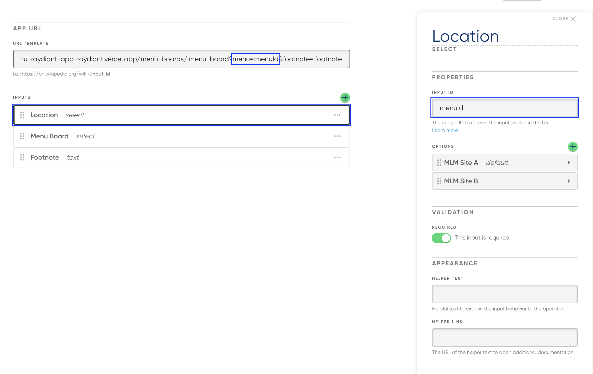
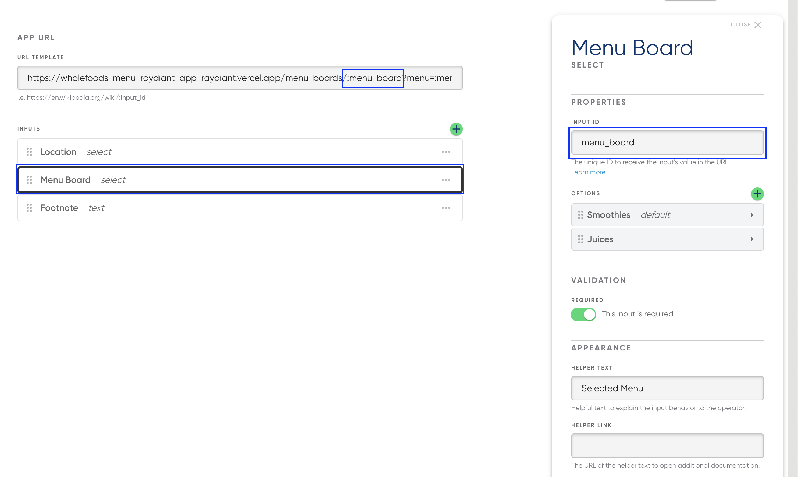
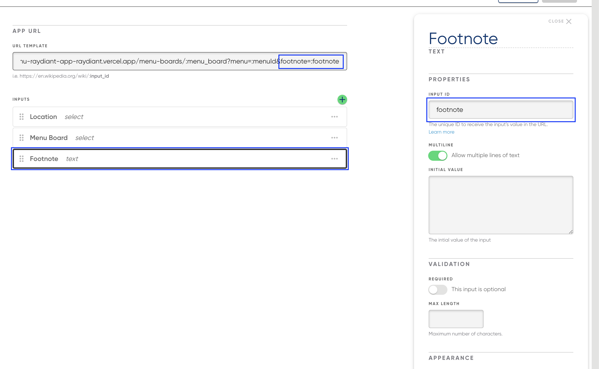

# NextJS Custom Menu App

**URLs**
_Note: Instructions on how to fetch `menuIds` for a given API key are available in the "Multi-location support" section below._

_Example menuId: 5ffd5ad4-d853-48cd-a19b-421490314676_

Localhost:

- Juices Menu Board: http://localhost:3000/menu-boards/juices?menu={menuId}&footnote={footnote}
- Smoothies Menu Board: http://localhost:3000/menu-boards/smoothies?menu={menuId}&footnote={footnote}

Production:

- Juices Menu Board: https://wholefoods.vercel.app/menu-boards/juices?menu={menuId}&footnote={footnote}
- Smoothies Menu Board: https://wholefoods.vercel.app/menu-boards/smoothies?menu={menuId}&footnote={footnote}

## Prerequisities

- Node (version defined in `.nvmrc`)
- Yarn
- `.env` file populated with values listed in `.env.sample`

## Development

Start the development server

```bash
yarn dev
```

## Adding App to Raydiant Platform

See [here](https://raydiant.notion.site/How-do-I-develop-an-app-487d7064eeec402fb7d376a5f6e6eed9) for a comprehensive guide to building Raydiant apps.

## Builder Inputs

There is one builder input for this project. Builder inputs can be configured after creating a new app in [Raydiant's Developer portal](https://developers.raydiant.com/)

- Location (select input) - Corresponds to a menu ID
  
- Menu Board (select input) - Corresponds to a NextJS route
  
- Footnote (text input) - Corresponds to a query param
  

## Multi-location/menu support

A couple of additional steps are required for multi-location/menu support.

1. Using your API key, make a call to `/v1/menus` to retrieve the list of menus your API key has access to

**cURL example:**

```
curl --location --request GET 'https://menu-api.raydiant.com/v1/menus' \
--header 'x-api-key: <API_KEY>'
```

2. Take note of all the `menuIds` required for your digital menu
3. Go to the developer portal and select your app
4. Creat a new "select" builder input
5. Populate the "options" section with the aforementioned `menuIds`
6. Confirm you can make an API request to fetch group data for a given menu/location

```
/v1/groups?tags=<tag>&menus=<menuId>depth=<depth>
```

## Deployment

CI/CD is setup to deploy our apps using the [Vercel Platform](https://vercel.com/new?utm_medium=default-template&filter=next.js&utm_source=create-next-app&utm_campaign=create-next-app-readme)

Check out our [Next.js deployment documentation](https://nextjs.org/docs/deployment) for more details.
